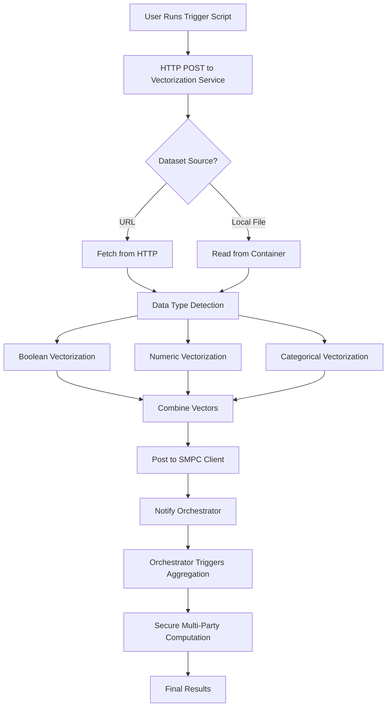

# 🚀 Athina Enhanced Vectorization Pipeline - Complete Documentation

## 📋 Table of Contents
1. [Overview](#overview)
2. [Architecture](#architecture)
3. [Pipeline Flow](#pipeline-flow)
4. [Data Types Support](#data-types-support)
5. [Setup & Installation](#setup--installation)
6. [Usage Guide](#usage-guide)
7. [API Reference](#api-reference)
8. [Examples](#examples)
9. [Troubleshooting](#troubleshooting)
10. [Advanced Configuration](#advanced-configuration)

---

## 🎯 Overview

The Athina Enhanced Vectorization Pipeline is a **secure multi-party computation (SMPC)** system that processes datasets with multiple data types (Boolean, Numeric, Categorical) while maintaining privacy through vectorization and secure aggregation.

### Key Features
- ✅ **Multi-Type Data Processing**: Boolean, Numeric, and Categorical features
- ✅ **Flexible Input**: Supports both local files and URL-based datasets
- ✅ **Backward Compatibility**: 100% compatible with existing boolean-only systems
- ✅ **Secure Aggregation**: SMPC-based privacy-preserving computation
- ✅ **Microservice Architecture**: Containerized, scalable services
- ✅ **Real-time Processing**: HTTP API for immediate processing

---

## 🏗️ Architecture

```
┌─────────────────────────────────────────────────────────────────────────────────┐
│                           ATHINA VECTORIZATION PIPELINE                          │
├─────────────────────────────────────────────────────────────────────────────────┤
│                                                                                 │
│  ┌─────────────────┐    ┌─────────────────┐    ┌─────────────────┐              │
│  │   Trigger       │    │ Vectorization   │    │ Computations    │              │
│  │   Script        │───▶│   Service       │───▶│ Orchestrator    │              │
│  │  (Python CLI)   │    │  (Flask API)    │    │  (Flask API)    │              │
│  └─────────────────┘    └─────────────────┘    └─────────────────┘              │
│                                   │                        │                     │
│                                   ▼                        ▼                     │
│                        ┌─────────────────┐    ┌─────────────────┐              │
│                        │   SMPC Client   │    │   Redis Store   │              │
│                        │   (Privacy)     │    │   (Metadata)    │              │
│                        └─────────────────┘    └─────────────────┘              │
│                                                                                 │
└─────────────────────────────────────────────────────────────────────────────────┘
```

### Component Responsibilities

| Component | Purpose | Port | Key Features |
|-----------|---------|------|--------------|
| **Trigger Script** | Initiates pipeline | - | CLI interface, dataset specification |
| **Vectorization Service** | Data processing | 5001 | Multi-type vectorization, file/URL support |
| **Computations Orchestrator** | Coordination | 5000 | Job management, aggregation control |
| **SMPC Client** | Privacy layer | 9001 | Secure computation, data anonymization |
| **Redis Store** | Metadata storage | 6379 | Schema storage, job state management |

---

## 🔄 Pipeline Flow

### Step-by-Step Process

```
1. TRIGGER
   └── User runs trigger script with dataset location
   
2. DATASET FETCH
   └── Vectorization service fetches from URL or local file
   
3. DATA ANALYSIS
   └── Automatic detection of data types (Boolean/Numeric/Categorical)
   
4. VECTORIZATION
   └── Convert statistics to numerical vectors based on data type
   
5. SMPC POSTING
   └── Send vectorized data to SMPC client for secure processing
   
6. ORCHESTRATOR NOTIFICATION
   └── Notify orchestrator that client processing is complete
   
7. AGGREGATION
   └── Orchestrator triggers secure multi-party aggregation
   
8. RESULTS
   └── Final aggregated results available for retrieval
```

### Detailed Flow Diagram



---

## 📊 Data Types Support

### Boolean Features
- **Input**: `numOfNotNull`, `numOfTrue`
- **Output Vector**: `[numOfNotNull, numOfTrue]`
- **Length**: 2 fields
- **Example**: User active status, feature flags

### Numeric Features
- **Input**: `numOfNotNull`, `min`, `max`, `avg`, `q1`, `q2`, `q3`, `histogram`
- **Output Vector**: `[numOfNotNull, min, max, avg, q1, q2, q3]`
- **Length**: 7 fields
- **Example**: Age, salary, scores, measurements

### Categorical Features
- **Input**: `numOfNotNull`, `valueSet`, `cardinalityPerItem`
- **Output Vector**: `[numOfNotNull, numUniqueValues, topValueCount]`
- **Length**: 3 fields
- **Example**: Department, country, product category

---

## 🛠️ Setup & Installation

### Prerequisites
- Docker & Docker Compose
- Python 3.9+
- Git

### Quick Start
```bash
# Clone repository
git clone <repository-url>
cd Athina

# Start all services
cd computations-orchestrator
docker-compose up -d

cd ../vectorization-service
docker-compose up -d

# Verify services
docker ps
```

### Service Endpoints
- **Vectorization Service**: `http://localhost:5001`
- **Orchestrator**: `http://localhost:5000`
- **SMPC Client**: `http://localhost:9001`
- **Redis**: `http://localhost:6379`

---

## 📖 Usage Guide

### Basic Usage - Local File

```bash
cd trigger-vectorization-pipeline
python trigger_vectorization.py \
  --vectorizationServiceUrl http://localhost:5001 \
  --url metadata-test.json \
  --jobId my_job_001 \
  --totalClients 1 \
  --orchestratorUrl http://host.docker.internal:5000
```

### Basic Usage - URL Dataset

```bash
python trigger_vectorization.py \
  --vectorizationServiceUrl http://localhost:5001 \
  --url https://example.com/dataset.json \
  --jobId my_job_002 \
  --totalClients 1 \
  --orchestratorUrl http://host.docker.internal:5000
```

### Multi-Client Scenario

```bash
# Client 1
python trigger_vectorization.py \
  --vectorizationServiceUrl http://localhost:5001 \
  --url client1_data.json \
  --jobId shared_job_001 \
  --totalClients 3 \
  --orchestratorUrl http://host.docker.internal:5000

# Client 2
python trigger_vectorization.py \
  --vectorizationServiceUrl http://localhost:5001 \
  --url client2_data.json \
  --jobId shared_job_001 \
  --totalClients 3 \
  --orchestratorUrl http://host.docker.internal:5000

# Client 3
python trigger_vectorization.py \
  --vectorizationServiceUrl http://localhost:5001 \
  --url client3_data.json \
  --jobId shared_job_001 \
  --totalClients 3 \
  --orchestratorUrl http://host.docker.internal:5000
```

---

## 🔌 API Reference

### Vectorization Service API

#### POST /vectorize
**Description**: Process a dataset and trigger the vectorization pipeline

**Request Body**:
```json
{
  "url": "dataset.json",
  "jobId": "unique_job_id",
  "totalClients": 1,
  "orchestratorUrl": "http://host.docker.internal:5000"
}
```

**Response**:
```json
{
  "message": "Vectorization completed.",
  "outputPaths": {
    "enhancedData": "/app/output/enhanced_dataset.json",
    "encodersOnly": "/app/output/encoders_only.json",
    "schema": "/app/output/schema.json"
  },
  "encodersCount": 1,
  "schemaCount": 6
}
```

### Orchestrator API

#### POST /api/update
**Description**: Notify orchestrator of client completion

**Request Body**:
```json
{
  "jobId": "unique_job_id",
  "clientId": "client_identifier",
  "totalClients": 3,
  "schema": [...]
}
```

---

## 💡 Examples

### Example 1: Employee Dataset
```json
{
  "entries": {
    "age": {
      "numOfNotNull": 1000,
      "min": 22,
      "max": 65,
      "avg": 35.5,
      "q1": 28,
      "q2": 35,
      "q3": 45
    },
    "isActive": {
      "numOfNotNull": 1000,
      "numOfTrue": 950
    },
    "department": {
      "numOfNotNull": 1000,
      "valueSet": ["Engineering", "Sales", "Marketing"],
      "cardinalityPerItem": [500, 300, 200]
    }
  }
}
```

**Vectorization Result**:
- `age`: `[1000, 22, 65, 35.5, 28, 35, 45]`
- `isActive`: `[1000, 950]`
- `department`: `[1000, 3, 500]`

### Example 2: Healthcare Dataset
```json
{
  "entries": {
    "patientAge": {
      "numOfNotNull": 500,
      "min": 18,
      "max": 80,
      "avg": 45.2,
      "q1": 30,
      "q2": 45,
      "q3": 60
    },
    "hasInsurance": {
      "numOfNotNull": 500,
      "numOfTrue": 450
    },
    "diagnosis": {
      "numOfNotNull": 500,
      "valueSet": ["Healthy", "Condition A", "Condition B"],
      "cardinalityPerItem": [300, 150, 50]
    }
  }
}
```

---

## 🔧 Troubleshooting

### Common Issues

#### 1. Container Connection Errors
**Problem**: Services cannot communicate  
**Solution**: 
- Use `host.docker.internal` for container-to-host communication
- Verify all containers are running: `docker ps`
- Check container logs: `docker logs <container_name>`

#### 2. File Not Found Errors
**Problem**: Dataset file not accessible  
**Solution**:
- Ensure file exists in container: `docker exec -it <container> ls /app/`
- Check file permissions and paths
- Verify file is copied during Docker build

#### 3. Port Conflicts
**Problem**: Services fail to start  
**Solution**:
- Check port availability: `netstat -an | grep <port>`
- Ensure ports 5000, 5001, 6379, 9001 are free
- Stop conflicting services

#### 4. Network Issues
**Problem**: Orchestrator notification fails  
**Solution**:
- Use correct orchestrator URL: `http://host.docker.internal:5000`
- Verify orchestrator is running and accessible
- Check Docker network configuration

### Debug Commands

```bash
# Check service health
curl -X POST http://localhost:5001/vectorize

# View container logs
docker logs vectorization_service_container
docker logs computations_orchestrator_container

# Access container shell
docker exec -it vectorization_service_container /bin/bash

# Check output files
docker exec -it vectorization_service_container ls -la /app/output/

# Test Redis connection
docker exec computations_redis redis-cli ping
```

---

## ⚙️ Advanced Configuration

### Environment Variables

#### Vectorization Service
```bash
ID=client_identifier          # Client ID for orchestrator
SMPC_URL=http://client1:9001  # SMPC client URL
```

#### Orchestrator
```bash
REDIS_HOST=redis              # Redis hostname
REDIS_PORT=6379               # Redis port
AGGREGATOR_URL=http://aggregator:8080  # Aggregator service URL
```

### Docker Compose Customization

```yaml
version: '3.8'
services:
  vectorization_service:
    build: .
    ports:
      - "5001:5001"
    environment:
      - ID=custom_client_id
      - SMPC_URL=http://custom_smpc:9001
    volumes:
      - ./custom_data:/app/data
```

### Production Considerations

1. **Security**: Use HTTPS endpoints in production
2. **Scaling**: Scale services horizontally using Docker Swarm/Kubernetes
3. **Monitoring**: Implement health checks and monitoring
4. **Logging**: Configure structured logging for production
5. **Backup**: Implement Redis backup strategy for job metadata

---

## 🧪 Testing

### Unit Tests
```bash
cd vectorization-service
python run_tests.py
```

### Integration Tests
```bash
# Follow TESTING_GUIDE.md for comprehensive testing
```

### Performance Testing
```bash
# Run multiple jobs concurrently
for i in {1..10}; do
  python trigger_vectorization.py \
    --vectorizationServiceUrl http://localhost:5001 \
    --url test_data_$i.json \
    --jobId perf_test_$i \
    --totalClients 1 \
    --orchestratorUrl http://host.docker.internal:5000 &
done
```

---

## 📚 Additional Resources

- **[TESTING_GUIDE.md](TESTING_GUIDE.md)**: Comprehensive testing procedures
- **[ENHANCED_VECTORIZATION_README.md](ENHANCED_VECTORIZATION_README.md)**: Technical implementation details
- **API Documentation**: Service-specific API documentation in each service directory

---

## 🤝 Contributing

1. Fork the repository
2. Create a feature branch
3. Implement changes with tests
4. Update documentation
5. Submit pull request

---

## 📄 License

[License information]

---

**🎉 Ready to process your datasets with enhanced vectorization and secure multi-party computation!** 